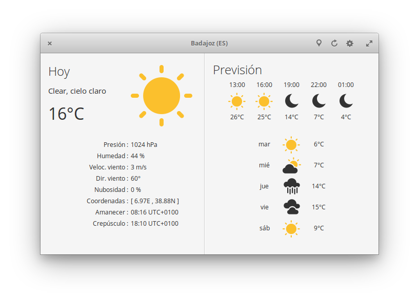

# Weather



### Know the forecast of the next hours & days.

Built in Vala, Granite & Gtk,using OpenWeatherMap API (https://openweathermap.org/)

### Features:

- Current weather, with information about temperature, pressure, wind speed and direction, sunrise & sunset.
- Forecast for next 18 hours.
- Forecast for next five days.
- Choose your units (metric or imperial).
- Choose your city.

### How To Build

Library Dependencies :

- gtk+-3.0
- libsoup-2.4
- json-glib-1.0
- granite-0.5

For advanced users!

	git clone https://github.com/bitseater/weather
	cd weather
	mkdir build
	cd build 
	cmake -DCMAKE_INSTALL_PREFIX=/usr ../
	sudo make install
