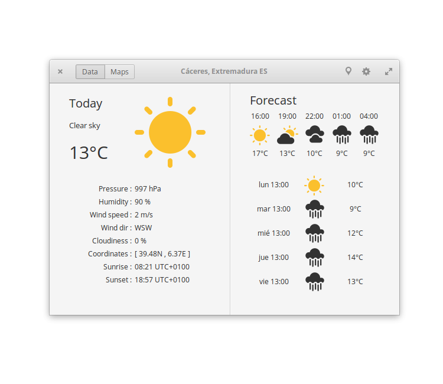
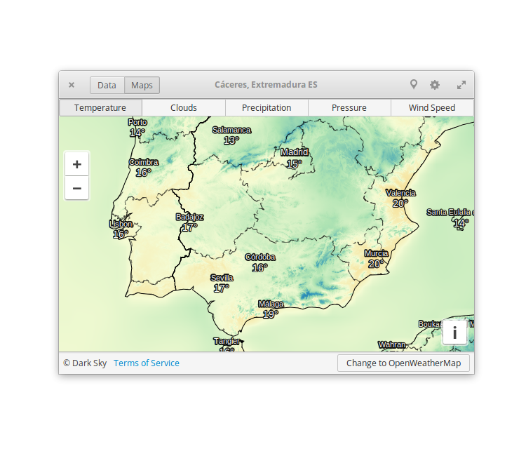
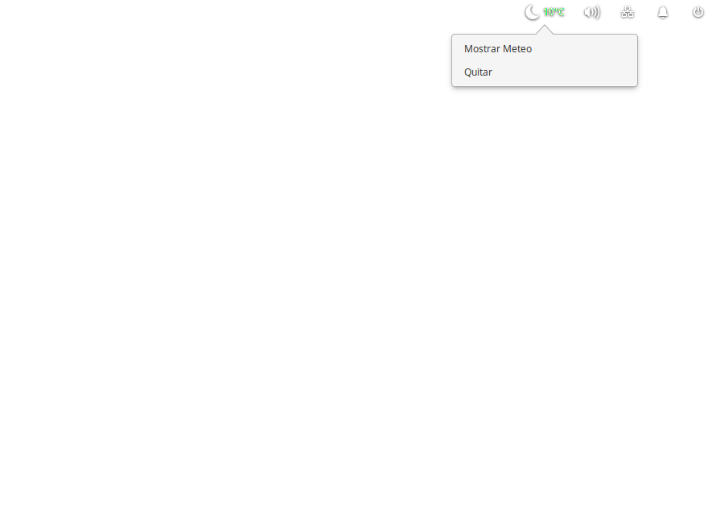

# METEO

 

 

### Know the forecast of the next hours & days.

Developed with Vala & Gtk,using OpenWeatherMap API (https://openweathermap.org/)

### Features:

- Current weather, with information about temperature, pressure, wind speed and direction, sunrise & sunset.
- Forecast for next 18 hours.
- Forecast for next five days.
- Choose your units (metric, imperial or british).
- Choose your city, with maps help.
- Awesome maps with weather info.
- System tray indicator.

### How To Build

Library Dependencies :

- gtk+-3.0
- libsoup-2.4
- json-glib-1.0
- clutter-1.0
- clutter-gtk-1.0
- champlain-0.12
- geocode-glib-1.0
- webkit2gtk-4.0
- appindicator3-0.1
- meson

For advanced users!

    git clone https://github.com/bitseater/weather
    cd weather
    ./quick.sh -b

----

#### New on release 0.6.1:

- Change appname to METEO.
- Save currenta data to cache file.
- Show cache file in text format.
- Add new translations: pt_PT and pt_BR.
- Reload button when own API key.

Fixed issues: #28 #29 #34 #36 #39 #44 #46 #47 #48 #54

----
#### Other screenshots:

**A map with temperatures by Dark Sky**

**A map with temperatures by OpenWeatherMap:**

**Indicator in wingpanel / system tray:**

